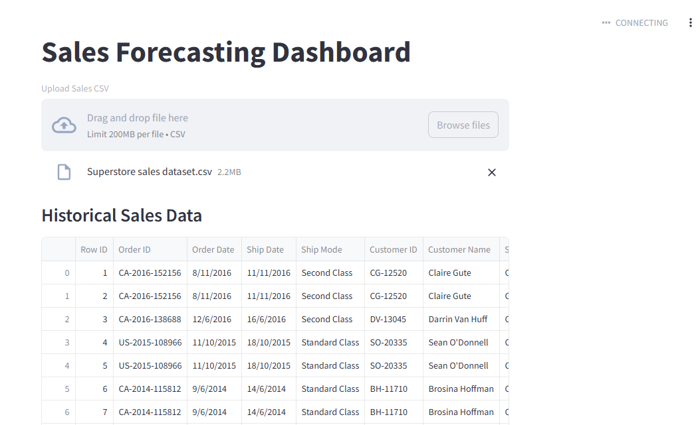

# Sales Forecasting Dashboard

An interactive machine learning dashboard built using Python, Streamlit, Pandas, and Scikit-learn to forecast future sales trends.

## Features

- Upload CSV sales datasets
- Analyze historical sales trends
- Predict future sales using Machine Learning
- Visualize forecasts with charts
- Display key business metrics
- Download forecast reports

## Technologies Used

- Python
- Pandas
- NumPy
- Scikit-learn
- Streamlit
- Matplotlib

## Dashboard Preview



## How to Run

```bash
pip install -r requirements.txt
streamlit run app.py
```

## Future Enhancements

- AI-powered sales insights
- Advanced forecasting models
- Azure deployment
- Real-time data integration